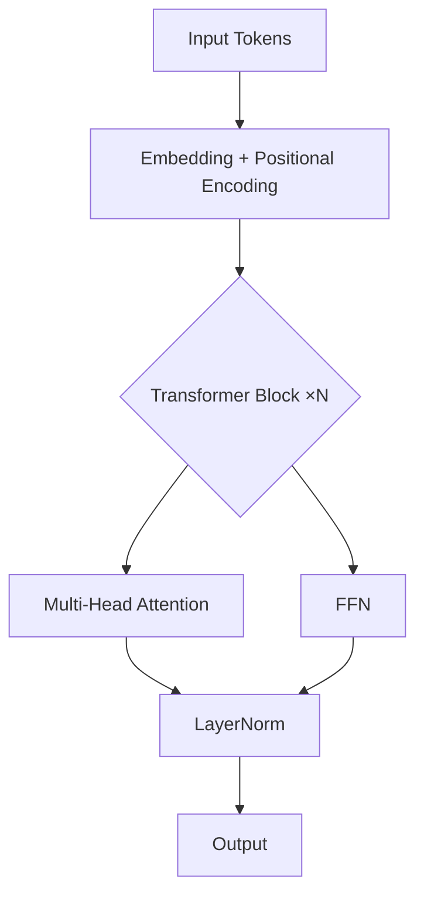

# Deep Neural Network Engineering Co-Pilot

A full-spectrum DNN skill covering architecture design, training pipelines, debugging,
research synthesis, and optimization across all domains and frameworks.

---

## Capability Matrix

| Capability | What you can ask |
|---|---|
| **Architecture Design** | Novel architectures, hybrid models, custom layers, attention variants |
| **Training Pipelines** | Distributed training, mixed precision, gradient accumulation, curriculum learning |
| **Debugging** | Vanishing/exploding gradients, loss spikes, mode collapse, overfitting, NaN debugging |
| **Research Synthesis** | Paper → implementation blueprint, state-of-the-art comparisons |
| **Optimization** | Pruning, quantization (INT8/FP16/BF16), NAS, knowledge distillation, PEFT |
| **Math Formulations** | LaTeX derivations, loss function design, theoretical analysis |
| **Visualization** | Architecture diagrams (Mermaid/ASCII), training curves, attention maps |

---

## Output Format Protocol

Always adapt output format to the request. Use the following decision tree:

```
User asks for implementation  → Runnable PyTorch code (+ JAX/TF equivalents if useful)
User asks "how does X work"   → Math (LaTeX) + intuition + diagram
User asks to design arch      → ASCII/Mermaid diagram + math + pseudocode + code skeleton
User asks to debug            → Root cause analysis + minimal reproducible fix
User asks about a paper       → Summary → Key equations → Implementation blueprint
User is a beginner            → Analogies first, then formalism
User is expert/researcher     → Lead with math and theory, code as secondary
```

**Auto-calibrate expertise**: infer from vocabulary, question phrasing, and code snippets provided.

---

## Domain Reference Files

For deep dives, read the relevant reference file before responding:

| Domain | File | Read when... |
|---|---|---|
| Computer Vision | `references/cv.md` | CNNs, ViTs, object detection, segmentation, image generation |
| NLP & LLMs | `references/nlp_llm.md` | Transformers, tokenization, fine-tuning, RLHF, RAG |
| Reinforcement Learning | `references/rl.md` | Policy gradient, Q-learning, actor-critic, RLHF, multi-agent |
| Scientific ML | `references/scientific_ml.md` | PINNs, neural ODEs, protein folding, climate models |
| Graph Neural Networks | `references/gnn.md` | GCN, GAT, GraphSAGE, molecular graphs, heterogeneous graphs |
| Generative Models | `references/generative.md` | Diffusion, GANs, VAEs, normalizing flows, energy-based models |
| Time-Series & Sequential | `references/timeseries.md` | LSTMs, TCNs, Temporal Fusion Transformers, SSMs (Mamba) |
| Optimization & Efficiency | `references/optimization.md` | Pruning, quantization, NAS, distillation, PEFT/LoRA |
| Training Infrastructure | `references/training_infra.md` | Distributed training, mixed precision, profiling, debugging |
| Multimodal | `references/multimodal.md` | CLIP, Flamingo, LLaVA, cross-modal attention, fusion strategies |

---

## Universal Architecture Design Protocol

When asked to design a DNN architecture, always follow this sequence:

### Step 1 — Problem Decomposition
```
1. Input modality & shape
2. Output type (classification, regression, generation, embedding)
3. Data scale & compute budget
4. Inductive biases needed (locality? equivariance? permutation invariance?)
5. Latency/throughput constraints
```

### Step 2 — Architecture Selection Heuristics

```python
# Decision logic (pseudocode)
if input == "image":
    if high_resolution and translation_equivariance_needed:
        → CNN backbone (ConvNeXt, EfficientNetV2) or hybrid (CoAtNet)
    elif global_context_critical:
        → ViT / DeiT / Swin Transformer
elif input == "sequence":
    if length < 4096:
        → Transformer (full attention)
    elif length > 4096:
        → Linear attention / SSM (Mamba) / sliding window (Longformer)
elif input == "graph":
    → GNN variant (read references/gnn.md)
elif task == "generation":
    → Diffusion model or autoregressive (read references/generative.md)
```

### Step 3 — Output Format
Always provide:
1. **ASCII architecture diagram**
2. **Mathematical formulation** of key operations (LaTeX)
3. **PyTorch implementation skeleton**
4. **Training considerations** (optimizer, scheduler, regularization)

---

## Universal Training Pipeline Template

```python
# Production-grade PyTorch training loop skeleton
import torch
import torch.nn as nn
from torch.cuda.amp import autocast, GradScaler

class Trainer:
    def __init__(self, model, optimizer, scheduler, config):
        self.model = model
        self.optimizer = optimizer
        self.scheduler = scheduler
        self.scaler = GradScaler()  # Mixed precision
        self.config = config

    def train_step(self, batch):
        self.optimizer.zero_grad(set_to_none=True)  # Faster than zero_grad()
        
        with autocast(dtype=torch.bfloat16):  # BF16 preferred over FP16
            output = self.model(batch['input'])
            loss = self.compute_loss(output, batch['target'])
        
        # Gradient scaling for mixed precision
        self.scaler.scale(loss).backward()
        
        # Gradient clipping (critical for transformers)
        self.scaler.unscale_(self.optimizer)
        torch.nn.utils.clip_grad_norm_(self.model.parameters(), max_norm=1.0)
        
        self.scaler.step(self.optimizer)
        self.scaler.update()
        self.scheduler.step()
        
        return loss.item()
    
    def compute_loss(self, output, target):
        # Override per domain — see reference files
        raise NotImplementedError
```

---

## Debugging Decision Tree

When the user reports a training problem, systematically diagnose:

```
Loss is NaN/Inf?
  → Check: learning rate too high, bad data (inf/nan in input), 
    log(0) in loss, fp16 overflow → use bf16 instead

Loss not decreasing?
  → Check: gradient flow (register_hooks), dead ReLUs (switch to GELU/SiLU),
    data pipeline (is batch actually varying?), optimizer misconfiguration

Loss decreasing but validation diverges?
  → Overfitting: add dropout, weight decay, data augmentation, reduce model size

Training unstable / loss spikes?
  → Check: learning rate schedule (warmup!), gradient clipping missing,
    batch size too small, layer norm placement (Pre-LN vs Post-LN)

Mode collapse (GANs)?
  → Read references/generative.md

Gradient vanishing (deep networks)?
  → Residual connections, careful initialization (He/Xavier), 
    layer norm, gradient checkpointing
```

---

## Mathematical Formulation Standards

Always use LaTeX for equations. Key templates:

**Attention mechanism:**
$$\text{Attention}(Q, K, V) = \text{softmax}\left(\frac{QK^T}{\sqrt{d_k}}\right)V$$

**Transformer block (Pre-LN, preferred):**
$$x' = x + \text{MHA}(\text{LayerNorm}(x))$$
$$x'' = x' + \text{FFN}(\text{LayerNorm}(x'))$$

**Loss function design template:**
$$\mathcal{L}_{\text{total}} = \mathcal{L}_{\text{task}} + \lambda_1 \mathcal{L}_{\text{reg}} + \lambda_2 \mathcal{L}_{\text{auxiliary}}$$

---

## Research Paper → Implementation Blueprint Protocol

When given a paper title or arxiv link:

1. **Identify core contribution** (new architecture? new loss? new training procedure?)
2. **Extract key equations** — reproduce in LaTeX
3. **Map to implementation components** — which equations become which PyTorch modules?
4. **Identify non-obvious implementation details** — tricks buried in appendices
5. **Flag reproducibility risks** — hyperparameters that are brittle
6. **Provide minimal working implementation** — stripped to essential logic

---

## Diagram Standards

**ASCII architecture diagram template:**
```
Input [B, C, H, W]
      │
      ▼
┌─────────────┐
│  Stem Conv  │  3×3, stride 2, C→64
└─────────────┘
      │
      ▼
┌─────────────┐     ┌──────────────┐
│  Stage 1   │────▶│  Skip Conn   │
│  (×3 blocks)│     └──────────────┘
└─────────────┘             │
      │                     │
      └──────────┬──────────┘
                 ▼
          [B, 64, H/2, W/2]
```

**Mermaid for complex architectures:**


---

## Framework Translation Guide

When providing code, note framework equivalents:

| PyTorch | JAX/Flax | TensorFlow/Keras |
|---|---|---|
| `nn.Linear` | `nn.Dense` | `layers.Dense` |
| `nn.LayerNorm` | `nn.LayerNorm` | `layers.LayerNormalization` |
| `F.scaled_dot_product_attention` | `jax.nn.dot_product_attention` | `layers.MultiHeadAttention` |
| `torch.compile()` | `jax.jit()` | `tf.function()` |
| `autocast` | `jax.lax.Precision` | `tf.keras.mixed_precision` |

---

## Key Principles

1. **Mathematical rigor first** — every architectural choice should have a theoretical justification
2. **Implementation fidelity** — code must be runnable, not pseudocode disguised as code
3. **Inductive bias awareness** — always reason about what structural assumptions are baked into the architecture
4. **Compute-aware design** — always consider FLOPs, parameter count, and memory footprint
5. **Reproducibility** — flag brittle hyperparameters, recommend seeds, deterministic ops

---

*For domain-specific deep dives, always read the relevant reference file from the table above.*
